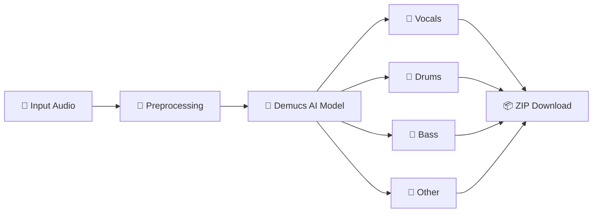

# 🎵 Demucs Audio Stem Separator

### AI-Powered Music Source Separation Tool

[](https://colab.research.google.com/drive/1AGUvK3xmbygN_V-KQ8EKSURKoxh8kXnP?usp=sharing)
[](https://github.com/raimohan/demucs-stem-separator/stargazers)
[](https://opensource.org/licenses/MIT)
[](https://www.python.org/downloads/)
[](https://gradio.app/)

<p align="center">
  
</p>

**Separate vocals, drums, bass, and other instruments from any song using Meta's Demucs AI model — completely free in Google Colab!**

[🚀 Try Now](#-quick-start) • [📖 Documentation](#-how-it-works) • [🎬 Demo](#-screenshots) • [⭐ Star History](#-star-history)

---

</div>

## ✨ Features

<table>
<tr>
<td width="50%">

### 🎯 **Core Features**
- 🎤 **Vocal Extraction** - Isolate clean vocals from any track
- 🥁 **Drum Separation** - Extract drum tracks perfectly
- 🎸 **Bass Isolation** - Get standalone bass lines
- 🎹 **Instrumental** - Remove vocals, keep the music

</td>
<td width="50%">

### ⚡ **Technical Highlights**
- 🚀 **GPU Accelerated** - CUDA support for fast processing
- 🎨 **Beautiful UI** - Modern Gradio interface
- 📦 **Batch Export** - Download all stems as ZIP
- 🔧 **No Setup** - Runs entirely in Google Colab

</td>
</tr>
</table>

---

## 🎬 Screenshots

<div align="center">

### 📱 User Interface


<br/><br/>

### ⚙️ Processing in Action


<br/><br/>

### 🎵 Output Results


</div>

---

## 🚀 Quick Start

### Option 1: Google Colab (Recommended) ⭐

<div align="center">

[](https://colab.research.google.com/drive/1AGUvK3xmbygN_V-KQ8EKSURKoxh8kXnP?usp=sharing)

**Click the button above and follow these steps:**

</div>

```
1️⃣  Open the Colab notebook
2️⃣  Runtime → Run all (or Ctrl+F9)
3️⃣  Wait for Gradio UI to load
4️⃣  Upload your audio file
5️⃣  Click "Separate" and download stems!
```

### Option 2: Local Installation

```bash
# Clone the repository
git clone https://github.com/raimohan/demucs-stem-separator.git
cd demucs-stem-separator

# Create virtual environment
python -m venv venv
source venv/bin/activate  # On Windows: venv\Scripts\activate

# Install dependencies
pip install -r requirements.txt

# Run the application
python app.py
```

---

## 📖 How It Works



### 🧠 The AI Behind It

This project uses **[Demucs](https://github.com/facebookresearch/demucs)** by Meta AI Research:

| Model | Description | Stems |
|-------|-------------|-------|
| `htdemucs` | Hybrid Transformer (Default) | 4 stems |
| `htdemucs_ft` | Fine-tuned version | 4 stems |
| `htdemucs_6s` | Extended model | 6 stems |
| `mdx_extra` | MDX competition winner | 4 stems |

### ⚙️ Processing Pipeline

```
┌─────────────────────────────────────────────────────────────┐
│                    DEMUCS STEM SEPARATOR                     │
├─────────────────────────────────────────────────────────────┤
│                                                             │
│  📁 Input          →  🔄 Convert    →  🧠 AI Model          │
│  (MP3/WAV/FLAC)       (to WAV)         (Demucs)            │
│                                                             │
│                    →  🎵 Separate   →  📦 Export            │
│                       (GPU/CPU)        (WAV/ZIP)           │
│                                                             │
└─────────────────────────────────────────────────────────────┘
```

---

## 🎛️ Supported Formats

### 📥 Input Formats
| Format | Extension | Max Size |
|--------|-----------|----------|
| MP3 | `.mp3` | 50 MB |
| WAV | `.wav` | 100 MB |
| FLAC | `.flac` | 100 MB |
| OGG | `.ogg` | 50 MB |
| M4A | `.m4a` | 50 MB |

### 📤 Output Format
- **WAV** (44.1kHz, 16-bit stereo)
- **ZIP** archive with all stems

---

## 🖥️ System Requirements

### Google Colab (Recommended)
| Component | Requirement |
|-----------|-------------|
| Runtime | Python 3 |
| Hardware | GPU (T4/V100/A100) |
| RAM | 12+ GB |
| Storage | 10+ GB free |

### Local Installation
| Component | Minimum | Recommended |
|-----------|---------|-------------|
| Python | 3.8+ | 3.10+ |
| RAM | 8 GB | 16 GB |
| GPU | - | NVIDIA 6GB+ VRAM |
| Storage | 5 GB | 10 GB |

---

## 📁 Project Structure

```
demucs-stem-separator/
│
├── 📓 Demucs_Stem_Separator.ipynb  # Main Colab notebook
├── 📜 app.py                        # Local Gradio app
├── 📜 requirements.txt              # Python dependencies
├── 📜 README.md                     # This file
├── 📜 LICENSE                       # MIT License
│
├── 📁 assets/                       # Images and media
│   ├── 🖼️ banner.png
│   ├── 🖼️ ui.png
│   ├── 🖼️ process.png
│   └── 🖼️ output.png
│
└── 📁 examples/                     # Sample audio files
    ├── 🎵 sample_input.mp3
    └── 🎵 sample_output/
```

---

## 🔧 Configuration Options

### Separation Modes

```python
# 2-Stem Mode (Vocals + Accompaniment)
┌────────────────────────────────────┐
│  🎤 Vocals    │  🎹 No Vocals      │
└────────────────────────────────────┘

# 4-Stem Mode (Full Separation)
┌────────────────────────────────────┐
│ 🎤 Vocals │ 🥁 Drums │ 🎸 Bass │ 🎹 Other │
└────────────────────────────────────┘
```

### Advanced Settings

| Setting | Default | Description |
|---------|---------|-------------|
| Model | `htdemucs` | AI model for separation |
| Device | Auto | GPU/CPU selection |
| Sample Rate | 44100 | Output audio quality |
| Clip Mode | Rescale | Handle audio clipping |

---

## 🎯 Use Cases

<table>
<tr>
<td align="center" width="25%">

<br/><b>Karaoke</b>
<br/>Remove vocals for singing
</td>
<td align="center" width="25%">

<br/><b>Remixing</b>
<br/>Isolate elements for remix
</td>
<td align="center" width="25%">

<br/><b>Practice</b>
<br/>Learn individual parts
</td>
<td align="center" width="25%">

<br/><b>Production</b>
<br/>Sample extraction
</td>
</tr>
</table>

---

## 📊 Performance Benchmarks

### Processing Speed (3-minute song)

| Hardware | 2-Stem | 4-Stem |
|----------|--------|--------|
| **Colab T4 GPU** | ~45s | ~60s |
| **Colab V100 GPU** | ~30s | ~40s |
| **Colab A100 GPU** | ~20s | ~25s |
| **CPU Only** | ~5min | ~8min |

### Memory Usage

```
┌─────────────────────────────────────────────┐
│ Model          │ GPU VRAM    │ System RAM   │
├─────────────────────────────────────────────┤
│ htdemucs       │ ~4 GB       │ ~6 GB        │
│ htdemucs_ft    │ ~4 GB       │ ~6 GB        │
│ htdemucs_6s    │ ~6 GB       │ ~8 GB        │
└─────────────────────────────────────────────┘
```

---

## 🛠️ Troubleshooting

<details>
<summary><b>❌ "CUDA out of memory" error</b></summary>

```python
# Solution 1: Use CPU mode
device = "cpu"

# Solution 2: Reduce audio length
# Split long audio files into segments

# Solution 3: Restart runtime
# Runtime → Restart runtime
```
</details>

<details>
<summary><b>❌ "TorchCodec not found" error</b></summary>

```python
# This is already fixed in the latest version!
# The app uses soundfile instead of torchcodec

# If you still see this error, update the notebook:
pip install soundfile
```
</details>

<details>
<summary><b>❌ "FFmpeg not found" error</b></summary>

```bash
# On Colab (automatic)
!apt-get install ffmpeg

# On Ubuntu/Debian
sudo apt-get install ffmpeg

# On macOS
brew install ffmpeg

# On Windows
# Download from: https://ffmpeg.org/download.html
```
</details>

<details>
<summary><b>❌ Slow processing on CPU</b></summary>

```
Solution: Use Google Colab with GPU runtime

1. Runtime → Change runtime type
2. Select "T4 GPU" or higher
3. Click Save
4. Re-run all cells
```
</details>

---

## 🤝 Contributing

Contributions are welcome! Here's how you can help:

```bash
# 1. Fork the repository
# 2. Create your feature branch
git checkout -b feature/AmazingFeature

# 3. Commit your changes
git commit -m 'Add some AmazingFeature'

# 4. Push to the branch
git push origin feature/AmazingFeature

# 5. Open a Pull Request
```

### 💡 Ideas for Contribution
- [ ] Add more Demucs models
- [ ] Implement batch processing
- [ ] Add audio visualization
- [ ] Create REST API
- [ ] Mobile-friendly UI

---

## 📈 Star History

<div align="center">

[](https://star-history.com/#raimohan/demucs-stem-separator&Date)

**If you find this project useful, please consider giving it a ⭐!**

</div>

---

## 📜 License

This project is licensed under the MIT License - see the [LICENSE](LICENSE) file for details.

```
MIT License

Copyright (c) 2024 raimohan

Permission is hereby granted, free of charge, to any person obtaining a copy
of this software and associated documentation files (the "Software"), to deal
in the Software without restriction...
```

---

## 🙏 Acknowledgments

<table>
<tr>
<td align="center">
<a href="https://github.com/facebookresearch/demucs">

<br/><b>Meta AI</b>
<br/>Demucs Model
</a>
</td>
<td align="center">
<a href="https://gradio.app">

<br/><b>Gradio</b>
<br/>Web UI Framework
</a>
</td>
<td align="center">
<a href="https://pytorch.org">

<br/><b>PyTorch</b>
<br/>Deep Learning
</a>
</td>
<td align="center">
<a href="https://colab.research.google.com">

<br/><b>Google Colab</b>
<br/>Free GPU
</a>
</td>
</tr>
</table>

---

## 📬 Contact

<div align="center">

**Created with ❤️ by [raimohan](https://github.com/raimohan)**

[](https://github.com/raimohan)
[](https://github.com/raimohan/demucs-stem-separator/issues)

---

<p align="center">
  
  <b>Happy Music Separation!</b>
  
</p>

</div>
